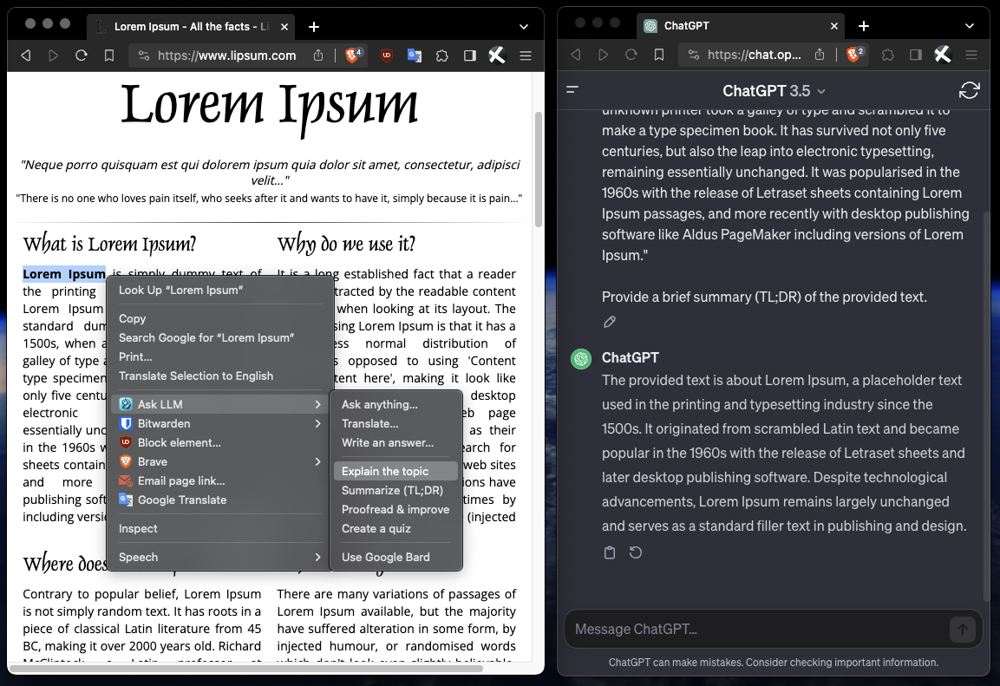
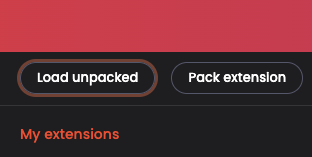

# Ask LLM



## Description

This Chrome extension lets you easily open a chat with LLM (ChatGPT or Bard) to ask questions about selected text, explain a link's contents, or create a quiz for the page.

Features:
- 💵 Free: uses ChatGPT/Bard chat directly (without OpenAI/Google APIs)
- 🔒 Safe: this extension does not store anything related to your Google or OpenAI accounts
- 🔍 Explain, summarize, translate, and improve the selected text, whole page, or links
- 💡 Create quizzes to test your knowledge

## Installation guide

1. Go to the extension directory:
```
cd chrome-extension
```

2. Install NPM packages:
```
npm i
```

3. Build the extension:
```
npm run build
```

4. Go to `chrome://extensions` in your browser (`Manage Extensions` button in your settings).

5. Enable `Developer mode`:


6. Click `Load unpacked` and select `chrome-extension/dist` directory:



7. Done ✅

### Safari

```
npm run build
xcrun safari-web-extension-converter --app-name safari-extension --macos-only --no-open --no-prompt --force --copy-resources ./dist
cd safari-extension
xcodebuild build
```

In Safari: Develop -> Developer Settings -> Allow unsigned extension

## Stack & tools
- React, TypeScript
- Vite, CrxJS
- Chrome Extension API

## Commands
- `npm run dev` – create a live development build
- `npm run build` – create a production build
