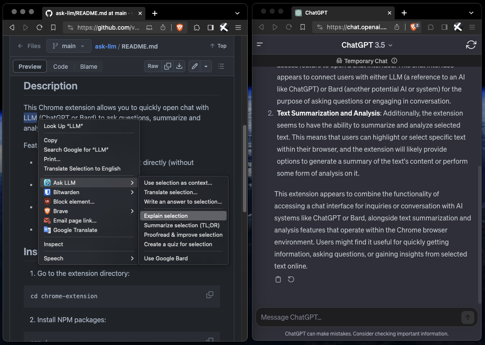

# Ask LLM

## Description

This Chrome extension allows you to quickly open chat with LLM (ChatGPT or Bard) to ask questions, summarize and analyze selected text.

Features:
- 💵 Free – uses ChatGPT/Bard chat directly (without OpenAI/Google APIs)
- 🔒 Safe – this extension does not store or use anything related to your Google or OpenAI accounts
- 🔍 Explain, summarize, translate and improve the selection
- 📑 Works with text selection and whole pages (subject to ChatGPT/Bard's message limits)

## Stack & tools
- React, TypeScript
- Vite, CrxJS
- Chrome Extension API

## Commands
- `npm run dev` – run bot locally
- `npm run build` – create a production build
